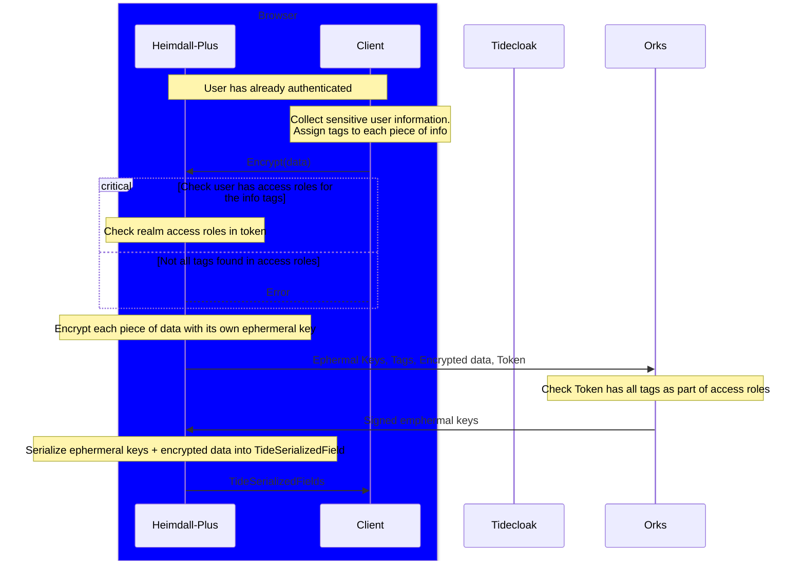

# Heimdall Plus
OpenIDConnect and TideConnect compatible client side JS library. This library was built on top of the existing [keycloak-js](https://www.keycloak.org/securing-apps/javascript-adapter) codebase, so all of keycloak-js' functions are available here, alongside Tide specific addons described below. 

## Prerequisites can be found [here.](https://docs.tidecloak.com/docs/EncryptDecrypt/SetupED)

## Network Flow of Heimdall Plus Encryption


## Initialization
> `npm install heimdall-plus`
```javascript
import Heimdall from "heimdall-plus"
import tcData from "/tidecloak.json";

const heimdall = new Heimdall({
  url: tcData['auth-server-url'],
  realm: tcData['realm'],
  clientId: tcData['resource'],
  vendorId: tcData['vendorId'],
  homeOrkUrl: tcData['homeOrkUrl']
});
```
## Encryption
```javascript
// heimdall.encrypt returns string[] where the list are the encrypted strings
// passed in the parameter object. Order returned is same order as what was passed.
const encrypted_dob = await heimdall.encrypt([
  {
    "data": "03/04/2005",
    "tags": ["dob"]
  }
])[0];

// before testing the below code, make sure you've set up the respected roles
const multi_encrypted_addresses = await heimdall.encrypt([
  {
    "data": "10 Smith Street",
    "tags": ["street"]
  },
  {
    "data": "Southport",
    "tags": ["suburb"]
  },
  {
    "data": "20 James Street - Burleigh Heads",
    "tags": ["street", "suburb"]
  }
]);
```
When encrypting or decrypting data, a user must have permission for all the tags attached to that data. For instance, if data is tagged "street", a user with the _tide_street.selfencrypt role can handle that data, but if data includes multiple tags (like "street" and "suburb"), the user must have both corresponding roles to access it.

## Decryption
```javascript

// heimdall.decrypt returns string[] where the list are the decrypted strings
// passed in the parameter object. Order returned is same order as what was passed.
const decrypted_dob = await heimdall.decrypt([
  {
    "encrypted": encrypted_dob, // from the encrypt code block above
    "tags": ["dob"]
  }
]);

// before testing the below code, make sure you've set up the respected roles
const decrypted_addresses = await heimdall.decrypt([
  {
    "encrypted": multi_encrypted_addresses[0],
    "tags": ["street"]
  },
  {
    "encrypted": multi_encrypted_addresses[1],
    "tags": ["suburb"]
  },
  {
    "encrypted": multi_encrypted_addresses[2],
    "tags": ["street", "suburb"]
  }
]);
```
